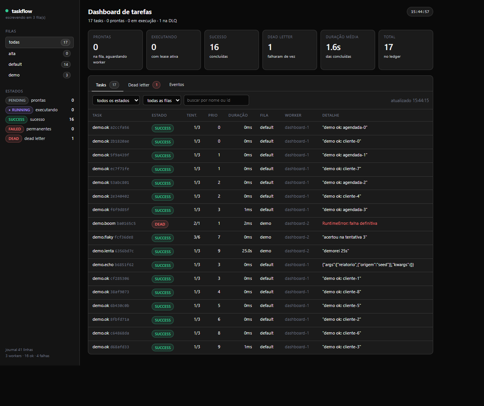
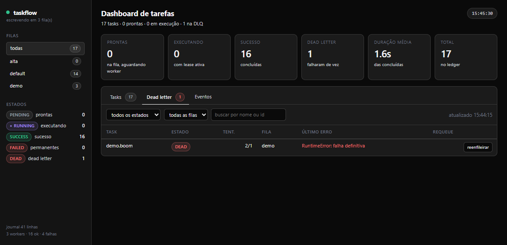

# taskflow


Fila de tarefas distribuída — um "mini-Celery" escrito do zero, em Python 3.11+,
**sem Celery, Redis, RQ ou Dramatiq**. O broker, a persistência, o event bus, o pool
de workers, o agendador cron, a dead letter queue, a CLI e o dashboard são código
deste repositório.



<sub>Dashboard em execução: `python -m taskflow.cli dashboard --workers 3`. Cada linha é uma task —
estado, tentativas, prioridade, duração, fila e worker que a executou.</sub>

```
taskflow/
├── taskflow/core        broker, persistência, estados, registro, serialização, eventos
├── taskflow/worker      pool assíncrono, política de retry, dead letter queue
├── taskflow/scheduler   parser de cron e loop de disparo periódico
├── taskflow/cli         submit · status · tasks · monitor · worker · dashboard · dlq · cron
├── taskflow/dashboard   FastAPI + WebSocket + página única com JS embutido
└── tests                125 testes cobrindo broker, worker, retry/DLQ, cron, CLI e disco
```

## Instalação

Requer **Python 3.11+** (testado em 3.13) e só quatro dependências:

```bash
python -m venv .venv
# Windows:      .venv\Scripts\activate
# Linux/macOS:  source .venv/bin/activate
pip install -r requirements.txt
```

## Quickstart (60 segundos)

```bash
# 1. declara as tasks em qualquer módulo
#    (o exemplo completo está em tests/demo_tasks.py)
#    @task(name="demo.ok", queue="default")
#    def ok(valor: str = "mundo") -> str: ...

# 2. registra o módulo de tasks e enfileira algo
python -m taskflow.cli --modules tests.demo_tasks tasks
python -m taskflow.cli --modules tests.demo_tasks submit demo.ok --args '["ana"]'

# 3. executa
python -m taskflow.cli --modules tests.demo_tasks worker -c 4 --drain

# 4. confere o resultado
python -m taskflow.cli status
```

> **Dica (Windows/PowerShell):** argumentos JSON com aspas internas às vezes são
> “comidos” pelo shell. Use `'[\"ana\"]'` ou evite espaços dentro do JSON.

### Modo dashboard (self-contained)

```bash
# sobe a interface web com 3 workers embutidos
$env:TASKFLOW_QUEUES = "default,demo"
python -m taskflow.cli --modules tests.demo_tasks dashboard --workers 3
# abra http://127.0.0.1:8000
```

## Como uma task percorre o sistema

```
  CLI / Dashboard / Scheduler │
            │ broker.submit("send_email", to=…)
            ▼ ┌───────────────────────────────────────────────┐
  │ Broker: heap por fila, chave (-prioridade, sequência) │
  │ journal.jsonl: append + flush a cada mudança           │  ← restart / crash
  └───────────────────────────────────────────────┘
            │ fetch()  →  lease + fencing token
            ▼
  ┌───────────────────────────────────────────────┐
  │ WorkerPool: N corrotinas, 1 task por vez       │
  │   asyncio.timeout(timeout)                    │
  └───────────────────────────────────────────────┘ │            │               │
     ack ✓ nack (backoff)    esgotou max_retries
   SUCCESS       RETRY → RE-ETA │
        │            │                 ▼
        └────────────┴──────────── DEAD → DLQ (requeue disponível)
                        │
                    EventBus (sequencial)
                    ├──▶ monitor TUI (ANSI, 4 Hz)
                    └──▶ WebSocket ──▶ dashboard web
```

### Garantias e limites (leia antes de usar em produção)

| Garantia | Como é obtida | Limite conhecido |
|---|---|---|
| **Nenhuma execução concorrente duplicada** | O `fetch` entrega a task com uma *lease* e o worker só busca outra quando termina. Não existe *prefetch*. | Um worker travado dentro da função continua "ocupando" a task até a lease vencer. |
| **Estado final único** | `ack`/`nack` exigem o `lease_id` correto (*fencing token*). Um worker lento, cuja lease foi recolhida e a task reexecutada por outro, recebe `StaleLeaseError` e não grava nada. | Não é *exactly-once* de efeitos colaterais: se sua task envia um e-mail e o processo morre antes do `ack`, o e-mail pode ser enviado duas vezes. O sistema é **at-least-once** com estado final único. |
| **Recuperação após worker morto** | A lease vence (`TASKFLOW_LEASE_SECONDS`) e o varredor devolve a task à fila; no *start* do processo, tasks em `RUNNING` voltam para `PENDENTE` (`recover_running_on_start`). | Exige que a task faça *checkpoint* se for longa. |
| **Persistência** | Journal JSONL *append-only* (uma linha por mudança, com a task inteira) + snapshot atômico com compaction. Recuperação = snapshot + replay, tolerante a linha truncada. | Escrita é **single-writer** por diretório (ver trava abaixo). `fsync` é opcional (`TASKFLOW_FSYNC=1`). |
| **Ordem de execução** | Prioridade maior primeiro; empate resolvido por FIFO (sequência monotônica). | — |
| **Ordem de eventos** | `EventBus.publish` é sequencial, na ordem de inscrição. | — |

### Um processo escritor por diretório

O broker toma uma **trava de escrita exclusiva** (`broker.lock`, via `msvcrt` no
Windows e `fcntl` no POSIX). Dois processos não escrevem no mesmo `data_dir`
simultaneamente: o segundo falha na hora, com mensagem explicando o que fazer.

```bash
# o worker segura a trava; para enviar tasks de outro processo:
python -m taskflow.cli --no-lock submit demo.ok
```

Com `--no-lock` (ou `TASKFLOW_LOCK=0`) a escrita concorrente passa a ser *best
effort*: funciona bem na prática porque o journal é append-only e as linhas são
pequenas, mas deixa de haver garantia. Comandos somente-leitura (`status`,
`monitor`, `dlq list`, `tasks`) nunca tomam a trava e funcionam a qualquer momento.

## Comandos

```bash
python -m taskflow.cli <comando> [--data-dir DIR] [--modules mod1,mod2] [--no-color]

submit     enfileira uma task registrada
status     detalhe de uma task (por id ou prefixo) ou resumo do broker
tasks      lista as tasks registradas no processo
monitor    visão ao vivo no terminal (ANSI)          [--once] [--interval] [--rows]
worker     sobe o pool de workers                    [-c N] [--queue F] [--drain] [--max-idle S]
dashboard  sobe a interface web                      [--host] [--port] [--workers N]
dlq        list | requeue [id] | purge
cron       next <expr> | check <expr>
```

Exemplos:

```bash
python -m taskflow.cli --modules tests.demo_tasks submit demo.flaky --args "[2]" --queue demo --max-retries 5
python -m taskflow.cli --modules tests.demo_tasks worker -c 2 --queue demo --drain
python -m taskflow.cli status --queue demo
python -m taskflow.cli dlq list
python -m taskflow.cli cron next "*/5 * * * *" --count 5
```

### `monitor` (TUI ao vivo)

```
taskflow monitor · filas: default, demo · 15:22:47 · journal 42 linhas
PEND 3  RUN 1  OK 17  ERRO 2  total 23

ID       TASK        ESTADO  TENT PRIO TEMPO   QUANDO   ERRO/VALOR
========+============+========+=====+======+=======+=========+=========================
8ae5ba0 demo.flaky   RETRY   2/5     7  8.1s   15:22:45 RuntimeError: falha numero 2
c9a8dfa demo.ok      SUCCESS 1/3     3  0.1s   15:22:44 "demo ok: cliente-3"

eventos
  15:22:47 failed demo.flaky tentativa 2/5 em 1.4s — RuntimeError: falha numero 2
```

Redesenho a 4 Hz com sequências ANSI (fora de um TTY, ou com `--once`, a saída
vira texto puro e determinístico — é assim que os testes verificam).

### `dashboard` (web, WebSocket)

Página única em `GET /`, com CSS e JS **embutidos** (sem CDN, sem build, funciona
offline), conectada por `WS /ws` que envia um snapshot ao conectar e a cada
evento, com coalescência (~4 msg/s).



<sub>Aba *Dead letter*: `demo.boom` esgotou os retries, guardou o erro e pode voltar à fila
com um clique — que zera as tentativas e dá um orçamento novo.</sub>

### Abas e recursos

- Abas **Tasks**, **Dead letter** (com botão *reenfileirar*) e **Eventos** (ticker ao vivo)
- Filtros por estado, fila e busca por nome/id; contadores por fila e por estado
- Badges coloridos por estado (`RUNNING` com pulso), dark mode automático,
  responsivo e com `prefers-reduced-motion`

Endpoints: `GET /`, `GET /api/state`, `GET /api/tasks`, `GET /api/dlq`,
`POST /api/dlq/{id}/requeue`, `GET /health`, `WS /ws`.

Por padrão o dashboard **apenas observa**; `--workers N` sobe um pool embutido.
Se outro processo já estiver segurando a trava, o dashboard cai para
somente-leitura e o botão de requeue responde `409` com o motivo.

## Agendador cron

```python
from taskflow.scheduler import CronExpression, Scheduler

cron = CronExpression.parse("*/5 * * * *")
cron.next_after(datetime(2024, 3, 5, 9, 2))   # datetime(2024, 3, 5, 9, 5)

agendador = Scheduler(broker, broker.config)
agendador.add_task(meu_registro.get("relatorio"), "0 9 * * 1-5", "pdf")
await agendador.start()
```

Sintaxe aceita em cada um dos 5 campos: `*`, `*/n`, `a`, `a-b`, `a-b/n` e listas
(`0,30`). Mês aceita `jan..dez`, dia da semana `dom..sab` (e `7` = domingo).
Quando **dia do mês** e **dia da semana** estão ambos restritos, vale a regra do
`crontab` do Vixie: dispara se **qualquer um** dos dois casar. Comentários com `#`
são ignorados.

Expressões inválidas levantam `CronError` dizendo qual campo e qual token falharam:

```python
CronExpression.parse("60 * * * *")
# campo 'minuto': valor 60 fora do intervalo 0-59 (em '60'); aceito '*', '*/n', …
```

O loop do agendador **não faz catch-up**: se o processo ficou 10 minutos parado, ele
dispara uma vez, não 10. `clock` e `sleep` são injetáveis, o que permite testar o
agendamento sem esperar de verdade.

## Usando como biblioteca

```python
from taskflow import task
from taskflow.core import Broker, Config, TaskRegistry
from taskflow.worker import WorkerPool

@task(name="send_email", queue="emails", priority=10, max_retries=5, timeout=30)
async def send_email(destino: str) -> str:
    return f"enviado para {destino}"

async def main() -> None:
    registro = TaskRegistry()
    registro.register(send_email)             # ou: registro.load_modules(["minhas_tasks"])
    broker = Broker(Config(data_dir=".taskflow"), registro)
    await broker.start()

    task = await broker.submit("send_email", "ana@exemplo.com")
    pool = WorkerPool(broker, registro, concurrency=4)
    await pool.start()
    await pool.drain()
    await pool.stop()
    await broker.stop()
```

## Configuração (variáveis `TASKFLOW_*`)

| Variável | Padrão | O que faz |
|---|---|---|
| `TASKFLOW_DATA_DIR` | `.taskflow` | diretório de estado (journal, snapshot, lock) |
| `TASKFLOW_QUEUES` | `default` | filas consumidas pelos workers |
| `TASKFLOW_DEFAULT_QUEUE` | `default` | fila quando a task não declara uma |
| `TASKFLOW_WORKER_CONCURRENCY` | `4` | workers por pool |
| `TASKFLOW_DEFAULT_MAX_RETRIES` | `3` | retries padrão (total de execuções = retries + 1) |
| `TASKFLOW_DEFAULT_TIMEOUT` | — | timeout padrão em segundos (vazio = sem timeout) |
| `TASKFLOW_LEASE_SECONDS` | `60` | duração da lease de execução |
| `TASKFLOW_RECLAIM_INTERVAL` | `5` | intervalo do varredor de leases vencidas |
| `TASKFLOW_RECOVER_RUNNING_ON_START` | `true` | devolve tasks `RUNNING` ao estado pendente no start |
| `TASKFLOW_RETRY_BASE` / `_CAP` / `_JITTER` | `0.5` / `30` / `true` | backoff exponencial com *full jitter* |
| `TASKFLOW_COMPACT_LINES` | `500` | linhas de journal que disparam snapshot |
| `TASKFLOW_LEDGER_LIMIT` | `1000` | tasks terminais mantidas no histórico |
| `TASKFLOW_FSYNC` | `false` | `fsync` a cada append (durabilidade contra queda de energia) |
| `TASKFLOW_LOCK` | `true` | trava de escrita exclusiva por `data_dir` |
| `TASKFLOW_MODULES` | — | módulos importados para registrar tasks |
| `TASKFLOW_DASHBOARD_HOST/PORT/WORKERS` | `127.0.0.1` / `8000` / `0` | dashboard |
| `TASKFLOW_MONITOR_INTERVAL` / `_ROWS` | `0.25` / `15` | `monitor` |
| `TASKFLOW_LOG_LEVEL` | `INFO` | nível de log |

## Testes

```bash
python -m pytest -q            # 125 testes
python -m pytest tests/test_retry_dlq.py -v
```

Cobertura por arquivo:

| Arquivo | Testes | Foco |
|---|---|---|
| `test_broker.py` | 17 | FIFO, prioridade, filas isoladas, `eta`, leases, filtros, trava, read-only |
| `test_worker.py` | 12 | end-to-end sync/async, ordem dos eventos, timeout, não-duplicação, resultado não serializável, heartbeat |
| `test_retry_dlq.py` | 15 | backoff/jitter, 2 falhas → sucesso na 3ª, esgotamento de retries, DLQ, requeue, purge |
| `test_scheduler.py` | 49 | 14 expressões válidas, 17 inválidas, `matches`, `next_after` com rollover, loop sem catch-up |
| `test_cli.py` | 21 | submit, status, tasks, monitor, worker `--drain`, dlq, cron, HTML/snapshot do dashboard |
| `test_persistence.py` | 11 | restart, resultado em disco, DLQ, task `RUNNING`, lease vencida, compaction, linha truncada, leitor concorrente |

## Decisões de projeto (e por quê)

1. **`FAILED` e `DEAD` são dois estados terminais diferentes, ambos na DLQ.**
   `DEAD` = orçamento de retries esgotado; `FAILED` = falha permanente que retry não
   resolve (task não registrada neste processo, retorno não serializável). Assim a
   DLQ guarda a *causa*, e o evento `dead` significa exatamente “acabaram os retries”.
2. **`max_retries` conta retries, não execuções.** Com `max_retries=2` a task roda
   até 3 vezes (a terceira falha vira `DEAD`).
3. **Timeout conta como falha** e entra no mesmo caminho de retry, com a mensagem
   `timeout após {N}s`.
4. **Nome de task não registrado é falha permanente**, não retry: repetir não
   registraria a task.
5. **Retorno não serializável é falha permanente**, e não um journal corrompido: o
   broker serializa o resultado antes de gravá-lo.
6. **Só existem 5 eventos** (`enqueued`, `started`, `success`, `failed`, `dead`).
   A informação de retry viaja no payload do `failed` (`will_retry`, `retry_in`,
   `next_eta`), evitando um sexto evento ambíguo.
7. **`recover_running_on_start` existe porque o diretório tem um único escritor.**
   Se ninguém está executando, a task que ficou `RUNNING` pertence a um processo
   morto — devolvê-la no start é seguro e torna o “restart” previsível.
8. **`fsync` é opcional.** O requisito é *sobreviver a restart de processo*, e
   `flush` já garante isso; `fsync` protege contra queda de energia, com custo.
9. **Argumentos do dashboard: worker embutido é opt-in.** O padrão é observar, para
   não duplicar trabalho quando já existe um worker externo.
10. **Arquivos fora da árvore pedida, e por quê:**
    `taskflow/cli/__main__.py` (necessário para `python -m taskflow.cli`, item 7 do
    enunciado), `pytest.ini` (modo asyncio) , `tests/conftest.py` (fixtures
    isoladas) e `tests/demo_tasks.py` (módulo de tasks usado nos testes da CLI).
11. **O dashboard escreve CSS à mão**, em vez de reaproveitar classes utilitárias de
    um framework: a página precisa funcionar sem CDN e sem etapa de build.

## Verificação manual dos cenários de aceitação

```bash
# 1. falha 2x, acerta na 3ª  ⇒  SUCCESS com attempts=3
python -m taskflow.cli --modules tests.demo_tasks tasks
python -m taskflow.cli --modules tests.demo_tasks submit demo.flaky --args "[2]" --queue demo --max-retries 5
python -m taskflow.cli --modules tests.demo_tasks worker -c 2 --queue demo --drain
python -m taskflow.cli status
# esperado: ESTADO SUCCESS, TENT 3/5

# 2. worker morto no meio  ⇒  task recuperada depois
python -m taskflow.cli --modules tests.demo_tasks submit demo.lenta --args "[30]" --queue demo --timeout 60
python -m taskflow.cli --modules tests.demo_tasks worker -c 1 --queue demo   # Ctrl+C / kill durante a execução
python -m taskflow.cli status                    # RUNNING com lease; aguarde lease_seconds
python -m taskflow.cli --modules tests.demo_tasks worker -c 1 --queue demo --drain
# esperado: SUCCESS, TENT 2 (a tentativa abandonada é preservada)

# 3. 10 tasks com prioridades misturadas  ⇒  ordem de prioridade
#    (envie 10 tasks com --priority de 0 a 9 e rode com -c 1 --drain;
#     a coluna QUANDO da saída mostra a ordem decrescente de prioridade)
python -m taskflow.cli status --queue demo
```

## Limitações conhecidas

- Um processo escritor por `data_dir` (trava de escrita).
- Lease vencida é detectada por **varredura periódica**, não por consenso: há uma
  janela entre a queda do worker e o recolhimento da task.
- A compaction mantém até `TASKFLOW_LEDGER_LIMIT` tasks terminais — o ledger é
  limitado por configuração, não ilimitado.
- Sem serialização de result sets em streaming: o retorno da task é serializado
  inteiro em JSON.

## Licença

MIT — veja [LICENSE](LICENSE). Feito por **Guilherme H Schmitz**.